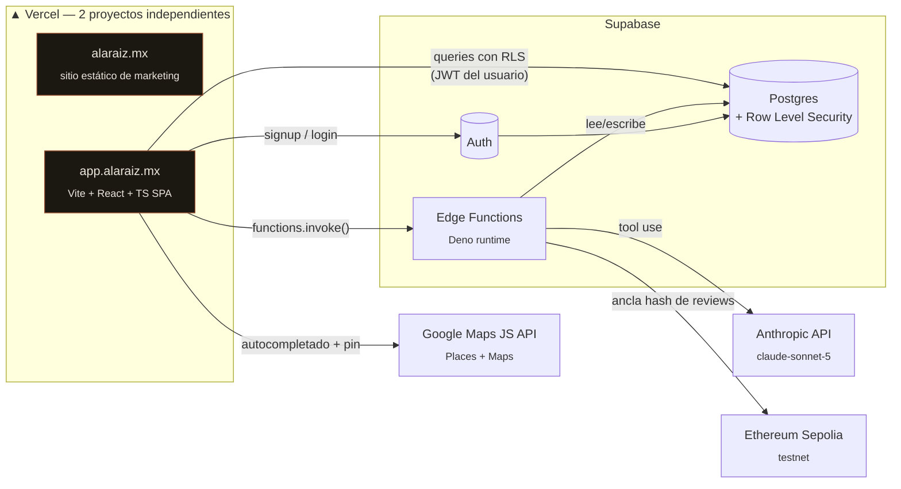
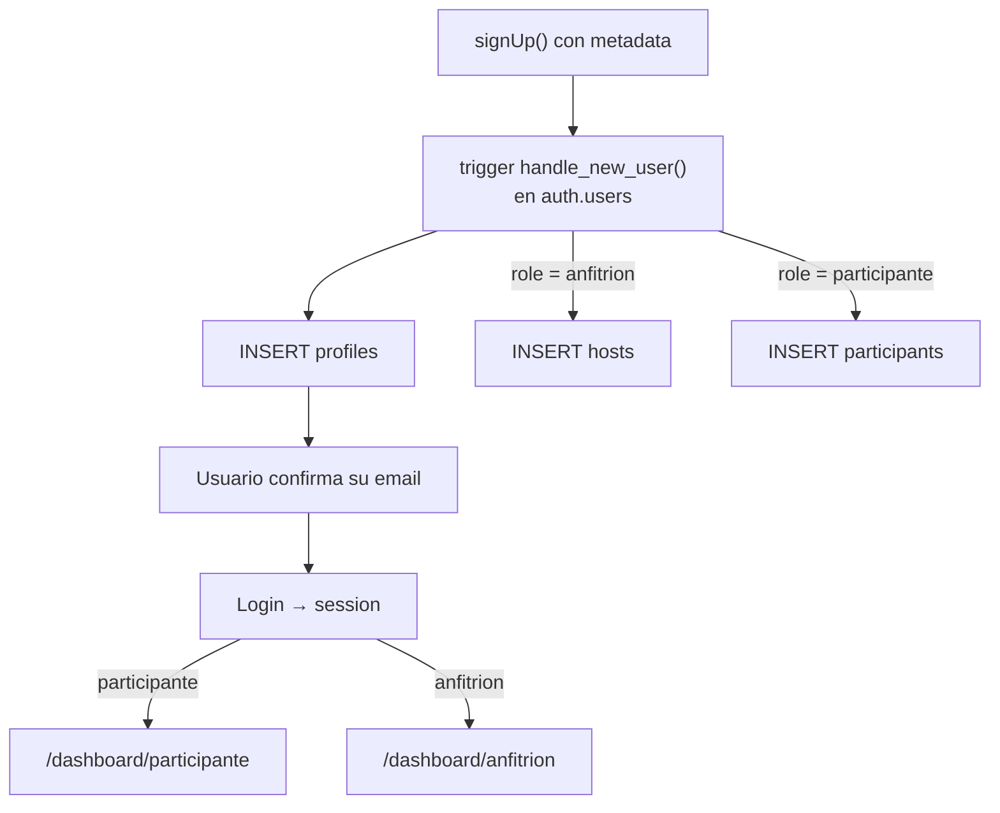
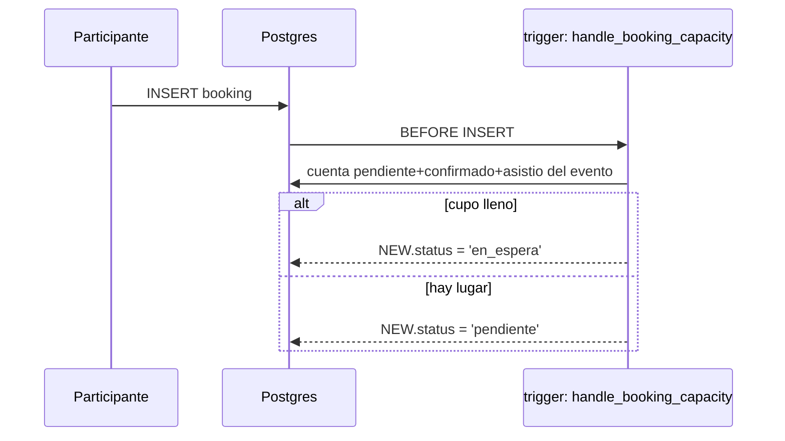
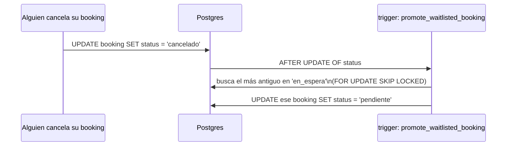
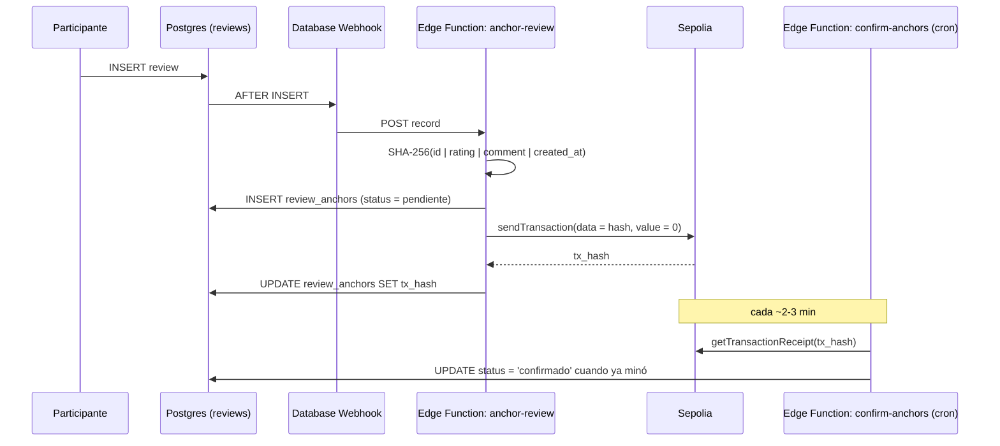
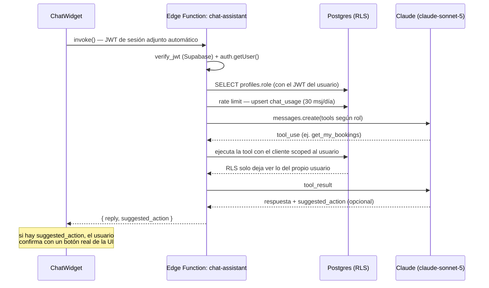
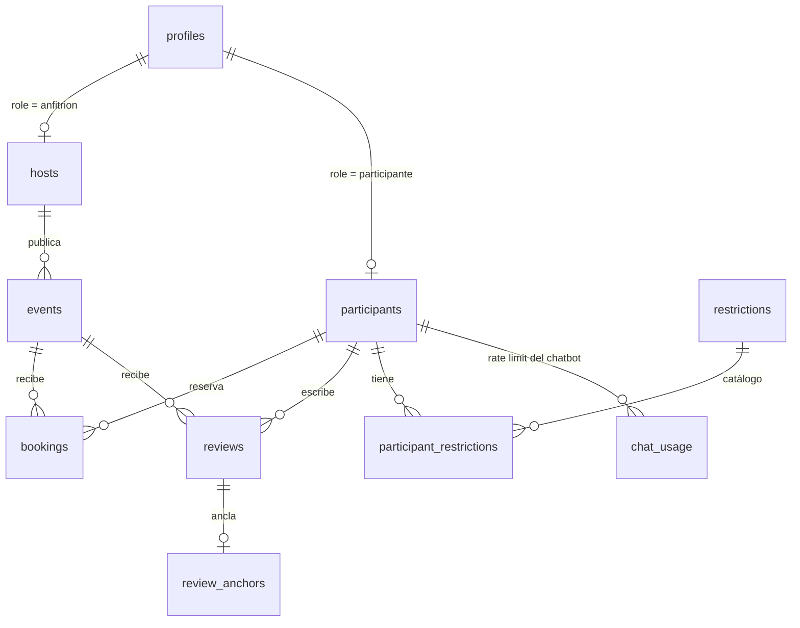

<div align="center">


# 🌱 Raíz

**Experiencias con raíz. Reservas con lógica. Reseñas con prueba.**

Plataforma de eventos/experiencias con autenticación por rol, reservas con
cupo real, reseñas verificadas en blockchain y dos asistentes de IA — todo
sobre Supabase (Postgres + RLS) y desplegado como dos proyectos
independientes en Vercel.

[](https://react.dev)
[](https://www.typescriptlang.org)
[](https://vitejs.dev)
[](https://supabase.com)
[](https://www.anthropic.com)
[](https://sepolia.dev)
[](https://developers.google.com/maps)
[](https://vercel.com)

</div>

---

## Tabla de contenido

- [¿Qué es esto?](#qué-es-esto)
- [Arquitectura](#arquitectura)
- [Stack](#stack)
- [Estructura del repo](#estructura-del-repo)
- [Features](#features)
  - [1. Auth por rol](#1-auth-por-rol)
  - [2. Eventos, reservas y cupo](#2-eventos-reservas-y-cupo)
  - [3. Lista de espera automática](#3-lista-de-espera-automática)
  - [4. Dirección con Google Maps](#4-dirección-con-google-maps)
  - [5. Accesibilidad estructurada](#5-accesibilidad-estructurada)
  - [6. Reseñas verificadas en blockchain](#6-reseñas-verificadas-en-blockchain)
  - [7. Asistentes de IA (chatbots)](#7-asistentes-de-ia-chatbots)
- [Modelo de datos](#modelo-de-datos)
- [Seguridad](#seguridad)
- [Casos de uso](#casos-de-uso)
- [Desarrollo local](#desarrollo-local)
- [Deploy](#deploy)
- [Roadmap](#roadmap)

---

## ¿Qué es esto?

**Raíz** es un negocio real de experiencias/turismo (`alaraiz.mx`). Este
repo contiene dos cosas distintas que viven juntas pero se despliegan por
separado:

1. **El sitio de marketing** (raíz del repo: `index.html`, `raiz-v3.css`,
   `assets/`) — estático, hecho a mano, es la cara pública de la marca.
2. **`app/`** — una SPA de React que le agrega a ese sitio todo lo que un
   sitio estático no puede hacer: cuentas de usuario, reservas reales con
   cupo, dashboards para anfitriones y participantes, y las features de
   este README.

El sitio estático **no sabe que `app/` existe** más que por un link en el
footer. `app/` corre en su propio subdominio (`app.alaraiz.mx`), su propio
proyecto de Vercel, y su propio pipeline de build — así un bug en uno nunca
puede tumbar al otro.

---

## Arquitectura



**Por qué dos proyectos de Vercel y no uno:** el sitio estático no necesita
build step ni variables de entorno; `app/` sí. Separarlos evita que el
código fuente de `app/` (o `supabase/`) termine sirviéndose por accidente
desde el dominio público — ver [`.vercelignore`](.vercelignore) en la raíz,
que excluye ambas carpetas del proyecto del sitio estático.

---

## Stack

| Capa | Tecnología | Por qué |
|---|---|---|
| Frontend | React 18 + TypeScript + Vite | SPA rápida, tipado end-to-end contra el schema real de Supabase |
| Routing | React Router v6 | rutas protegidas por rol (`ProtectedRoute`) |
| Backend | Supabase (Postgres + Auth + RLS) | seguridad a nivel de fila en vez de lógica de permisos duplicada en el backend |
| Serverless | Supabase Edge Functions (Deno) | blockchain anchoring, cron de confirmación, chatbots — todo sin servidor propio |
| IA | Anthropic API (`claude-sonnet-5`, tool use) | dos asistentes con acceso de solo lectura a datos reales del usuario |
| Blockchain | Ethereum Sepolia vía [viem](https://viem.sh) | prueba de integridad de reseñas, sin wallet ni cripto visible al usuario |
| Mapas | `@react-google-maps/api` (Places + Maps JS) | autocompletado de dirección + mapa de confirmación |
| Deploy | Vercel (×2 proyectos) | sitio estático y SPA se despliegan y escalan por separado |

---

## Estructura del repo

```text
alaraiz-mx/
├── index.html, raiz-v3.css, assets/      # sitio de marketing (estático)
├── .vercelignore                          # excluye app/ y supabase/ del sitio estático
│
├── app/                                    # SPA — app.alaraiz.mx
│   ├── src/
│   │   ├── pages/                          # Home, Events, EventDetail, Login, Register
│   │   │   └── dashboard/                  # HostDashboard, ParticipantDashboard, EventForm
│   │   ├── components/                     # Nav, ChatWidget, AddressAutocompleteField, ProtectedRoute
│   │   ├── context/AuthContext.tsx         # sesión + profile, expuesto vía useAuth()
│   │   ├── lib/                            # supabaseClient, googleMapsUrl
│   │   ├── types/database.ts               # tipos calcados 1:1 del schema real (sin inventar columnas)
│   │   ├── tokens.css, index.css           # sistema de diseño, portado literal de raiz-v3.css
│   │   └── ConfigMissing.tsx               # fallback si faltan env vars (nunca pantalla en blanco)
│   └── .env.example                        # plantilla de env vars (sin valores reales)
│
└── supabase/
    ├── manual_migrations/                  # 001…008, se corren a mano en el SQL Editor
    └── functions/                          # anchor-review, confirm-anchors, chat-assistant
```

---

## Features

### 1. Auth por rol

Signup manda toda la metadata (`role`, `full_name`, `business_name`/`emergency_contact_*`,
etc.) en `supabase.auth.signUp({ options: { data: {...} } })`. Un trigger
`security definer` en `auth.users` crea las filas de `profiles` +
`hosts`/`participants` **en el servidor**, apenas se crea el usuario —
necesario porque el proyecto tiene confirmación de email activada, así que
no hay sesión disponible en el cliente justo después de registrarse.



`ProtectedRoute` bloquea rutas de dashboard por `profile.role`; el rol
**nunca** se confía del cliente en el backend (ni en RLS ni en las Edge
Functions) — siempre se vuelve a leer de `profiles` con el JWT ya
verificado.

### 2. Eventos, reservas y cupo

Un anfitrión publica eventos (`borrador` → `publicado` → `finalizado`/`cancelado`).
Un participante reserva; el booking nace en `pendiente` y el anfitrión lo
mueve a `confirmado`/`asistio`/`no_asistio`/`cancelado` a mano desde su
dashboard — nunca hay confirmación automática.

### 3. Lista de espera automática

Si un evento tiene `capacity` y ya está lleno (`pendiente` + `confirmado` +
`asistio` ≥ `capacity`), el booking nuevo nace en `en_espera` en vez de
`pendiente` — decidido por un trigger, no por el cliente, para que no haya
condición de carrera entre dos personas reservando el último lugar al mismo
tiempo.



Cuando alguien cancela, se promueve automáticamente al más antiguo en
espera — a `pendiente`, no a `confirmado` directo, para que pase por el
mismo control manual que cualquier otra reserva:



`FOR UPDATE SKIP LOCKED` evita que dos cancelaciones simultáneas promuevan
el mismo booking dos veces — si eso pasa, cada transacción promueve a una
persona distinta de la fila, que es el comportamiento correcto.

### 4. Dirección con Google Maps

`AddressAutocompleteField` envuelve `@react-google-maps/api`: autocompletado
de Places restringido a México, y al elegir una sugerencia guarda
`latitude`/`longitude` además del texto — se muestra un mapa chico con un
pin para que el anfitrión confirme visualmente antes de guardar. Si falta la
API key o el script no cargó, degrada a un `<input>` de texto normal — nunca
rompe el formulario. Tanto en el listado como en el detalle del evento hay
un link **"Ver en Google Maps"** que usa las coordenadas si existen, o el
texto de la dirección si no (para eventos viejos sin geocodificar).

### 5. Accesibilidad estructurada

El campo de accesibilidad pasó de texto libre a una lista fija de
checkboxes (`camino plano`, `rampas`, `baños accesibles`, apoyo visual/auditivo,
`estacionamiento accesible`, etc. + "Otro" con texto libre opcional) — se
sigue guardando como `jsonb` array de strings (sin migración de datos:
eventos viejos con texto libre se precargan en "Otro" al editarlos). Se
muestra como badges (`.chip`) en vez de una lista separada por comas, tanto
en el listado público como en el detalle.

### 6. Reseñas verificadas en blockchain

Cuando un participante deja una reseña, se ancla su hash en Sepolia — sin
que el usuario necesite wallet ni sepa que existe blockchain de por medio.
La wallet es propiedad del proyecto (custodial), y todo corre server-side.



El anclaje es **best-effort y no bloqueante**: si Sepolia falla, la reseña
ya se guardó igual (`review_anchors.status = 'fallido'`, la review no se
pierde). En el dashboard del anfitrión, las reseñas ancladas y confirmadas
muestran un badge ✓ que linkea al explorer de Sepolia.

### 7. Asistentes de IA (chatbots)

Dos chatbots (uno por rol) con acceso a datos reales vía tool use de Claude
— con una regla no negociable: **el modelo nunca escribe nada directo en la
base de datos.**



| | Tools (solo lectura) |
|---|---|
| **Anfitrión** | `get_my_events`, `get_event_bookings`, `get_event_summary` |
| **Participante** | `get_restrictions_catalog`, `get_my_restrictions`, `get_my_profile`, `get_published_events`, `get_my_bookings`, `propose_add_restriction` |

`propose_add_restriction` es puramente estructural: no toca la base de
datos, solo hace que el frontend muestre un botón — al confirmarlo, se
reusa el mismo código (`toggleRestriction`) que ya usa el dashboard normal.
El cliente de Supabase dentro de la función siempre está scoped al JWT del
usuario (anon key + header de auth) — **nunca** `service_role`.

---

## Modelo de datos



Migraciones manuales (`supabase/manual_migrations/`, se corren a mano en el
SQL Editor, en orden):

| # | Qué hace |
|---|---|
| `001` | trigger de alta de perfil, RLS de visibilidad anfitrión↔asistente, policies de `bookings` |
| `002` | tabla `review_anchors` + RLS (solo lectura pública, escritura solo `service_role`) |
| `003` | tabla `chat_usage` (rate limit del chatbot) |
| `004` | columnas `latitude`/`longitude` en `events` |
| `005` | `alter type booking_status add value 'en_espera'` (**debe correrse sola**, ver nota abajo) |
| `006` | triggers `handle_booking_capacity` y `promote_waitlisted_booking` |
| `007` | RLS de `events` ampliada para que un participante lea eventos donde tiene booking, sin importar status |
| `008` | fix de recursión infinita que introdujo `007` (ver [Seguridad](#seguridad)) |

> **Nota real de campo:** un `ALTER TYPE ... ADD VALUE` no se puede usar
> dentro del mismo bloque de transacción en el que se agregó — `005` y
> `006` están separados por esto a propósito, no por accidente.

---

## Seguridad

- **RLS-first, siempre.** Ninguna tabla de negocio se protege con lógica de
  aplicación — todo pasa por policies de Postgres, evaluadas con el JWT real
  del usuario.
- **`service_role` nunca sale de las dos Edge Functions internas**
  (`anchor-review`, `confirm-anchors`), que además son las únicas que se
  despliegan con `--no-verify-jwt` — porque solo las llama el sistema
  interno de Supabase (webhook/cron), nunca un usuario. `chat-assistant` es
  user-facing: se despliega **con** verificación de JWT, y usa un cliente
  scoped por request (anon key + header de auth), nunca `service_role`.
- **El rol de un usuario nunca se confía del cliente** — ni en RLS ni en
  Edge Functions se lee `role` de lo que manda el frontend; siempre se
  vuelve a consultar `profiles` con el JWT ya verificado.
- **Secretos solo como env vars/secrets**, nunca en código: `.env.local`
  está gitignoreado en tres niveles (raíz, `app/`, `supabase/`), y los
  secretos de Edge Functions (`SEPOLIA_PRIVATE_KEY`, `ANTHROPIC_API_KEY`)
  viven en `supabase secrets set`, no en el repo.
- **Incidente real, resuelto en producción:** al ampliar la policy de
  `events` (`007`) para que un participante pudiera leer eventos
  `finalizado` donde tenía un booking, la nueva policy consultaba
  `bookings`, y la policy existente de `bookings` consultaba `events` de
  vuelta — recursión infinita, la app completa quedó caída. El fix (`008`)
  mueve el `exists(...)` a una función `security definer`: su consulta
  interna corre con los privilegios del dueño de la función, no del usuario
  que llama, así que no vuelve a disparar las policies de `bookings` y el
  ciclo se rompe ahí. Queda documentado en la migración porque es el tipo
  de bug que vuelve a aparecer si alguien "simplifica" una policy sin
  pensar en el grafo de dependencias entre tablas con RLS.

---

## Casos de uso

**Participante se registra y reserva un evento lleno**
1. Se registra (`role: participante`) → el trigger crea su `profile` + `participant`.
2. Ve `/eventos`, entra al detalle, reserva.
3. El evento ya está en capacidad → su booking nace en `en_espera` y el
   frontend se lo dice explícitamente (no como si fuera un error).
4. Alguien más cancela → su booking se promueve solo a `pendiente`.
5. El anfitrión lo confirma manualmente desde su dashboard.

**Anfitrión publica un evento y gestiona su ciclo de vida**
1. Crea el evento: dirección con autocompletado + pin de confirmación,
   checkboxes de accesibilidad, cupo.
2. Lo pasa de `borrador` a `publicado`.
3. Revisa reservas y reseñas agrupadas por evento en su dashboard — eventos
   `finalizado` aparecen colapsados por defecto para no saturar la vista.
4. Le pregunta al chatbot un resumen del evento (`get_event_summary`) en
   vez de sumar reservas a mano.

**Participante deja una reseña verificable**
1. Asistió (`status = 'asistio'`) → puede dejar reseña.
2. La reseña se guarda al instante; el anclaje en Sepolia pasa en segundo
   plano, sin que lo note.
3. Minutos después, el anfitrión ve el badge ✓ verificado en su dashboard,
   linkeando a la transacción real en el explorer.

**Cualquiera de los dos usa el chatbot**
1. Pregunta algo en lenguaje natural ("¿tengo restricciones registradas?",
   "resúmeme las reservas del evento X").
2. El modelo consulta con tools de solo lectura, scoped al usuario real.
3. Si la respuesta implica una acción (ej. agregar una restricción), el
   chat muestra un botón — la escritura la hace el usuario, no el modelo.

---

## Desarrollo local

```bash
cd app
npm install
cp .env.example .env.local   # llenar con tus propios valores, nunca commitear
npm run dev
```

Variables de entorno (`app/.env.local`):

| Variable | Para qué |
|---|---|
| `VITE_SUPABASE_URL` / `VITE_SUPABASE_ANON_KEY` | cliente de Supabase (públicas por diseño, protegidas por RLS) |
| `VITE_GOOGLE_MAPS_API_KEY` | autocompletado + mapa (pública por diseño, protegida por restricción de HTTP referrer en Google Cloud Console) |

Secrets de Edge Functions (`supabase secrets set ...`, nunca en el repo):
`SEPOLIA_RPC_URL`, `SEPOLIA_PRIVATE_KEY`, `ANTHROPIC_API_KEY`.
`SUPABASE_URL`/`SUPABASE_ANON_KEY`/`SUPABASE_SERVICE_ROLE_KEY` los inyecta
Supabase automáticamente en cada función.

---

## Deploy

Dos proyectos de Vercel apuntando al mismo repo:

| Proyecto | Root Directory | Dominio |
|---|---|---|
| Sitio estático | `/` (raíz) | `alaraiz.mx` |
| App | `app/` | `app.alaraiz.mx` |

El proyecto del sitio estático usa `.vercelignore` (raíz) para nunca servir
`app/` ni `supabase/`; el de la app tiene su propio `app/vercel.json`.

---

## Roadmap

- [ ] Edición de perfil del participante desde el chatbot (hoy es solo lectura)
- [ ] Notificación real (email/push) cuando se promueve de lista de espera
- [ ] Code-splitting del bundle de `app/` (Google Maps ya lo hizo cruzar los 500KB)
- [ ] Panel de verificación pública de reseñas (buscar por hash, sin login)

